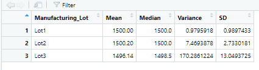
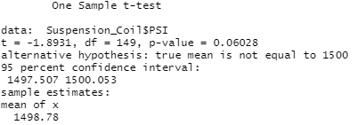
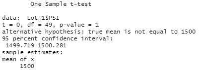
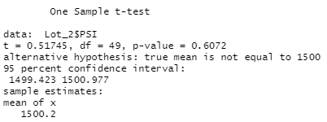
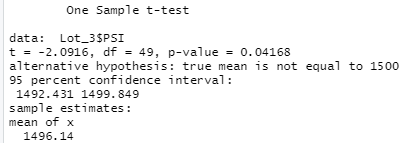

# Challenge15- MechaCar Statistical Analysis

AutosRUs’ newest prototype, the MechaCar, is suffering from production troubles that are blocking the manufacturing team’s progress. Data Analytics team is reviewed production data for insights that may ghelp manufacturing team. 

## Linear Regression to Predict MPG

We want to predict the MPG, to do so, we executed a Multiple Linear Regression (MLR) using MechaCar_mpg.csv basis containing historical information of the MPG per vehicle associated with its length, weight, spoiler's angle, ground clearance, and AWD. 

The model assumes a linear relation as follows: 

mpg ~ a1 * vehicle_length + a2 * vehicle_weight + a3 * spoiler_angle + a4 * ground_clearance + a5 * AWD + C

The analysis results are as follows: 

**Multiple Linear Regression Model Results**

The MLR explains over 70% of the total variance which is strong enough to consider its results as indicative, additionally, in the summary output, the last column show the probability that each coefficient contributes a random amount of variance to the linear model, thus, vehicle length and ground clearance seems to de determinant in the vehicle's MLR (intercept is statistically significant too, but probably is just working as a fit among scales). 

Both statistically significant variables have non-zero coeficients and both are positive, this means that increases in any of them may result in an increase in the MPG of the vehicle. 

## Summary Statistics on Suspension Coils

Four our second analysis ,we receved the Suspension_Coil.csv dataset, this one contains the results from multiple production lots. In this dataset, the weight capacities of multiple suspension coils were tested to determine if the manufacturing process is consistent across production lots, the design specifications for the MechaCar suspension coils dictate that the variance of the suspension coils must not exceed 100 pounds per square inch. 

**Total Summary**

**Summary per Lot**

We can conclude two things: 

1) Variance of the suspensions comply with design specifications at a Total level. 
2) Lot 3's is inconsistent since its variance exceeds the maximum pounds per square inch agreed.

## T-Test on Suspension Coils

General PSI of the total production has a 1,500 pounds per square inch mean, we now want to know if the new lots are in line with the total population (production) of the plant. To do so, we are testint through a T Test on the total lots and per lot:  

**T Test of the total production**

**T- Test per Lot**

Recall: Assuming our significance level was the common 0.05 percent, if our p-value is above our significance level we do not have sufficient evidence to reject the null hypothesis, and we would state that the the tasted mean is statistically similar to the population's mean. 

Results: 

1) Total Production's mean is statistically similar to the population's mean. 
2) Lot 1 (Mean = 1,500) and Lot 2 (Mean=1,500.2) are also statistically similar to the population's mean, lot 3 (Mean = 1,496.14) is not. 

## Design a Study Comparing the MechaCar to the Competition

As some final comments on the study, we would propose to invest some additional time (and possible money) into a further analysis that may be performed to test MechaCar performance against our competition at consumer's preference. 

To do so, we want to review our competitor's total sales against each of their model's specs to identify which are the specs that customers evaluate as more important in the top sales models, to do so, we would need to get statistical information of the sales per model and the main specs to run a regression as follows: 

**total_sales = a1 * Spec_1 + a2 * Spec_2 + ... + an * Spec_n + C**

Note the analyzed specs may range from MPG to specific media or security technologies, additionally, results still need to be reviewed to identify statistical significance per Spec (p-value) and total regression explanation power (R^2), surely, some variables may not be statistically significant, thus, we would want to remove them from our model to avoid overfitting problems. 

If data is adequate, this analysis would let us identify the most valued specs and compare them against our models, this way, we may be able to identify if our models are competitive at specs level based on consumer's preferences. 
