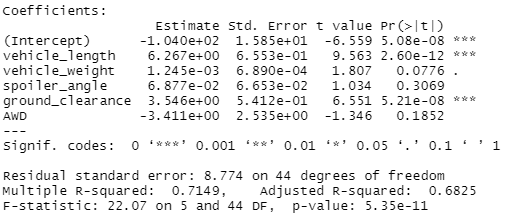

# Challenge15- MechaCar Statistical Analysis

AutosRUs’ newest prototype, the MechaCar, is suffering from production troubles that are blocking the manufacturing team’s progress. Data Analytics team is reviewed production data for insights that may ghelp manufacturing team. 

## Linear Regression to Predict MPG

We want to predict the MPG, to do so, we executed a Multiple Linear Regression (MLR) using MechaCar_mpg.csv basis containing historical information of the MPG per vehicle associated with its length, weight, spoiler's angle, ground clearance, and AWD. 

The analysis results are as follows: 

## Summary Statistics on Suspension Coils

## T-Test on Suspension Coils

## Design a Study Comparing the MechaCar to the Competition

